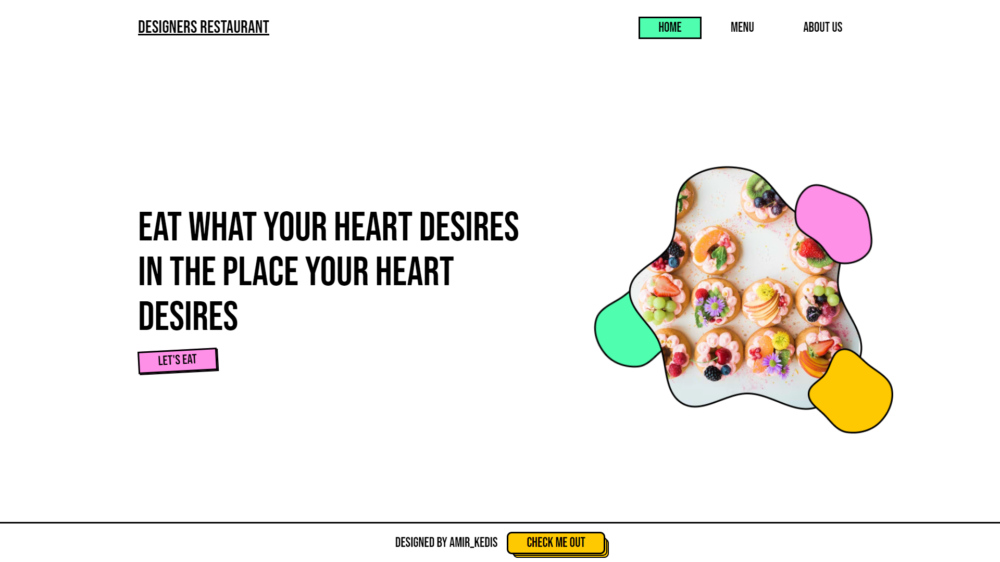

# Designers Restaurant

This repository contains a project called Designers Restaurant, which was created as part of The Odin Project's curriculum. The project focuses on practicing DOM manipulation and Webpack, utilizing Vanilla JavaScript to generate all the content. The website's design follows the neo-brutalism style, combining simplicity and raw aesthetics.

## Preview

You can check out the live preview of the Designers Restaurant [here](https://amir-kedis.github.io/designers-restaurant-page)

## Features

- Dynamic generation of restaurant content using Vanilla JavaScript.
- Responsive layout for optimal viewing on various devices.
- Unique and visually striking design inspired by neo-brutalism.
- Seamless navigation and user-friendly interface.

## Installation

To run this project locally, follow these steps:

1. Clone the repository: `git clone https://github.com/amir-kedis/designers-restaurant-page.git`.
2. Navigate to the project's directory: `cd designers-restaurant`.
3. Install the dependencies: `npm install`.
4. Build the project using Webpack: `npm run build`.
5. Open the `index.html` file in your preferred web browser.

## Development

If you want to make changes to the project or contribute, here's how to set up the development environment:

1. Follow steps 1-3 from the installation process mentioned above.
2. Start the development server: `npm run start`.
3. Make your desired changes to the source files.
4. The changes will be automatically compiled and reflected in the browser.

## Credits

The Designers Restaurant project was created by [Amir Kedis](https://github.com/amir-kedis) as part of The Odin Project's curriculum. 

## License

This project is licensed under the [MIT License](LICENSE). Feel free to use, modify, or distribute it as per the license terms.

Please note that this project was created for educational purposes and does not represent a real restaurant. The content and images used are for demonstration purposes only.

Feel free to explore the Designers Restaurant Project. If you have any suggestions or feedback, please don't hesitate to reach out. Enjoy!
